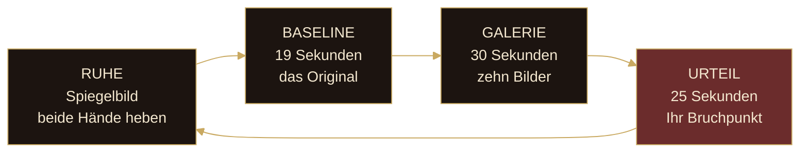
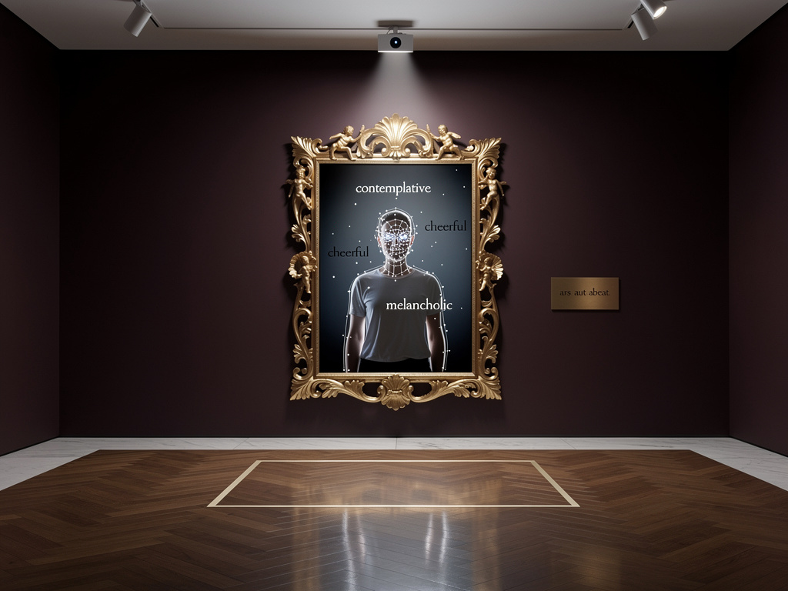
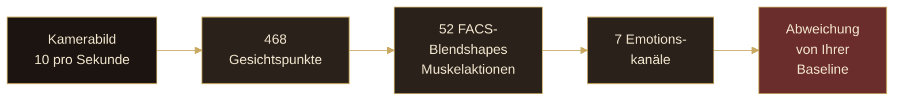
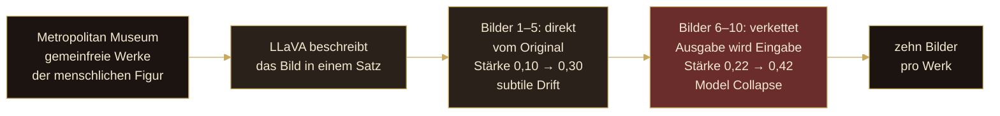
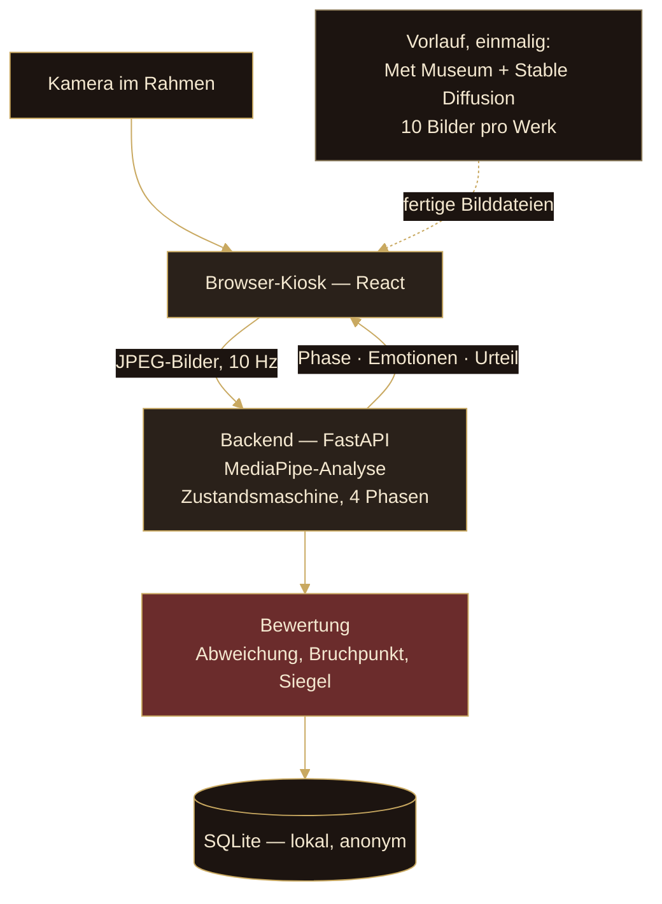

# Was hier passiert

> *Ab welchem Punkt erkennt ein Mensch die eigene Spezies als falsch?*

Vor Ihnen hängt ein Bild, das sich verändert. Hinter Ihnen steht niemand. Und trotzdem werden Sie beobachtet — von einer Kamera im Rahmen, die währenddessen Ihr Gesicht liest.

**Vallis Simulacri** ist keine Installation über Künstliche Intelligenz. Die KI ist nur das Werkzeug. Das eigentliche Ausstellungsobjekt sind **Sie**: Ihr Nervensystem, und der genaue Moment, in dem es Alarm schlägt.

Ein klassisches Gemälde der menschlichen Figur wird zehnmal von einer KI neu interpretiert. Mit jedem Durchgang entfernt sich das Bild weiter vom Original. Züge verschwimmen, Proportionen kippen, das Vertraute wird falsch. Die Kamera misst dabei Ihre unwillkürlichen Mikroreaktionen — zuerst vor dem unveränderten Original, dann vor jedem der zehn Bilder.

Das Bild, bei dem Ihre Reaktion am stärksten ausschlägt, ist Ihr persönlicher **Bruchpunkt**. Das Bild davor war für Sie noch Kunst. Ab hier ist es keine mehr.

*Ars aut abeat* — Kunst, oder sie gehe.

---

# Ablauf einer Sitzung

Eine Sitzung dauert knapp anderthalb Minuten und läuft vollständig autonom. Sie müssen nichts bedienen — außer dem Startsignal.

## RUHE

Der Bildschirm zeigt Ihr eigenes Spiegelbild, überlagert von den Worten, die Ihr Gesicht gerade sagt. Im Wechsel läuft ein Attract-Screen mit den gesammelten Daten aller bisherigen Besucher.

**Beide Hände heben, anderthalb Sekunden halten** — das startet die Sitzung. Diese Geste ist bewusst gewählt: Sie ist Einverständnis, und sie ist eine Geste der Preisgabe. Man stellt sich vor eine Kamera, öffnet die Arme und unterwirft sich der Analyse.

## BASELINE — 19 Sekunden

Das unveränderte Original erscheint, mit Titel und Beschreibung zum Lesen. Während Sie lesen, liest die Kamera Sie: zehnmal pro Sekunde wird Ihr Gesichtsausdruck vermessen und zu einem Durchschnitt gemittelt.

Dieser Durchschnitt ist Ihr persönlicher Nullpunkt — **so sieht Ihr Gesicht vor echter Kunst aus**. Ohne diesen Nullpunkt wäre jede spätere Messung wertlos, denn manche Menschen schauen grundsätzlich skeptisch und andere grundsätzlich freundlich. Gemessen wird nicht Ihr Ausdruck, sondern Ihre *Veränderung*.

## GALERIE — 30 Sekunden

Zehn KI-degradierte Bilder, alle drei Sekunden eines, mit weicher Überblendung. Wie ein Gang durch eine Galerie, an zehn Werken vorbei.

Jedes Bild sammelt sein eigenes Reaktionsprofil aus etwa dreißig Messpunkten. Dabei wird eine **Reaktionsverzögerung von 0,7 Sekunden** eingerechnet: Ein Gesichtsausdruck folgt dem Reiz, er läuft ihm nicht voraus. Was Sie in Sekunde 12,0 zeigen, gehört zu dem Bild, das in Sekunde 11,3 erschien.

## URTEIL — 25 Sekunden

Drei Bilder nebeneinander: links das Original, in der Mitte das letzte Bild, das für Sie noch Kunst war — gesiegelt mit **ARS** in Gold. Rechts der Bruchpunkt, gesiegelt mit **ABEAT** in Rot.

Darunter zeichnet sich eine Kurve: Ihre Reaktion über alle zehn Bilder hinweg, der Bruchpunkt markiert. Darunter steht: *HIER STARB DIE KUNST FÜR SIE.*

{width=full}

---

# Wie gemessen wird

Die Installation liest keine Gedanken. Sie liest Muskeln.

## Vom Gesicht zur Zahl

Das **Facial Action Coding System** (FACS) ist ein etabliertes Verfahren der Verhaltensforschung: Jede Gesichtsregung wird in einzelne Muskelaktionen zerlegt — Mundwinkel links oben, Nasenflügel gerümpft, Augenbraue innen angehoben. Die Kamera erkennt 52 dieser Aktionen und gewichtet sie zu sieben Emotionskanälen.

Wichtig: Das ist keine Gedankenlesemaschine. Es ist eine Muskelmessung. Was gemessen wird, ist *Bewegung* — nicht Bedeutung.

## Der Bruchpunkt

Für jedes der zehn Bilder wird ausgerechnet, wie weit Ihr Ausdruck von Ihrer Baseline abweicht. Nicht jede Regung zählt gleich viel: Die Emotionen des Unbehagens wiegen schwerer als die der Zustimmung, weil genau sie das Signal des Uncanny Valley sind.

| Emotion | Gewicht | | Emotion | Gewicht |
|---|---|---|---|---|
| **Ekel** | 1,0 | | Trauer | 0,5 |
| **Furcht** | 0,9 | | Freude | 0,5 |
| Überraschung | 0,7 | | Neutral | 0,2 |
| Wut | 0,6 | | | |

Das Bild mit der stärksten gewichteten Abweichung ist Ihr Bruchpunkt. Das Bild davor bekommt das Siegel **ARS**, der Bruchpunkt selbst **ABEAT**.

## Die drei Siegel

Wie tief Sie gefallen sind, verdichtet ein lateinisches Siegel:

| Siegel | Bedeutung | Abweichung |
|---|---|---|
| **VALLIS** | *Das Tal* — starke Reaktion, tief gefallen | ab 0,25 |
| **LIMEN** | *Die Schwelle* — messbar, aber mild | 0,08 bis 0,25 |
| **FIRMA** | *Fester Boden* — keine Regung, *ars mansit* | unter 0,08 |

**FIRMA** ist kein Versagen. Es heißt: Für Sie hat es nie aufgehört, Kunst zu sein.

---

# Wie die Bilder entstehen

Die zehn Bilder pro Werk werden nicht live erzeugt — das würde Minuten dauern. Sie entstehen in einem Vorlauf, der einmal pro Katalog läuft.

## Zwei Phasen, zwei Arten von Falschheit

**Bilder 1 bis 5** entstehen jeweils direkt aus dem Original, mit langsam steigender Freiheit. Die KI darf ein bisschen mehr, dann noch ein bisschen mehr. Das Bild bleibt das Gemälde — es driftet nur.

**Ab Bild 6** wird die KI mit ihrer eigenen Ausgabe gefüttert. Das ist ein Phänomen mit einem Namen in der Forschung: **Model Collapse**. Ein Modell, das seine eigenen Erzeugnisse wieder als Eingabe bekommt, verstärkt seine eigenen statistischen Vorlieben und vererbt seine eigenen Fehler. Jede Iteration erbt die Verzerrung der vorigen und legt eine neue darauf.

Das Ergebnis ist keine zufällige Zerstörung. Es ist *gerichtete* Zerstörung: Das Bild driftet auf den inneren Prototypen der Maschine zu. Gesichter werden symmetrischer, als ein echtes Gesicht je ist. Haut glättet sich zu einem idealisierten Durchschnitt. Und gleichzeitig häufen sich die Artefakte — das Licht wird falsch, Kanten weichen auf, Details vermehren sich, wo sie verschwinden sollten.

Genau diese Kurve — langsame Annäherung, dann Sturz — bildet das Uncanny Valley selbst ab.

## Warum klassische Gemälde

Ein klassisches Figurengemälde ist bereits eine Interpretation des menschlichen Körpers — idealisiert, stilisiert, gefiltert durch Technik und Tradition. Es trägt die Entscheidung eines *anderen Menschen* darüber, wie der Körper auszusehen hat.

Gibt man das einer KI, entsteht eine zweite Interpretationsschicht: wie die Maschine glaubt, dass ein Körper aussieht — gelernt aus Millionen Bildern menschlicher Kultur. Was Sie sehen, ist nicht ein verzerrtes Foto. Es ist der aufgestaute **Abstand zwischen zwei Arten von Verstehen**, dem menschlichen und dem maschinellen. Dieser Abstand, sichtbar gemacht, ist das Uncanny Valley.

---

# Die Technik

Die gesamte Installation läuft **offline** auf einem einzigen Rechner im Raum. Keine Cloud, keine Übertragung, kein Internet.

| Schicht | Technologie |
|---|---|
| Laufzeit | FastAPI + React, Browser-Kiosk, WebSocket |
| Gesichtsanalyse | Google MediaPipe FaceLandmarker — 52 FACS-Blendshapes |
| Aktivierung | MediaPipe PoseLandmarker — Handheben als Auslöser |
| Bildgenerierung | Stable Diffusion v1.5, img2img, vorberechnet |
| Bildbeschreibung | LLaVA über Ollama, mit Fallback |
| Persistenz | SQLite — lokal, anonym |
| Bildquelle | Metropolitan Museum of Art, Open Access |

Der Bildstrom läuft mit zehn Bildern pro Sekunde von der Kamera zum Backend. Ein Hintergrund-Thread analysiert dabei immer nur das jeweils neueste Bild — nichts staut sich auf, nichts wird nachgeholt. Die Zustandsmaschine läuft im selben Takt und schickt nur dann etwas zurück, wenn sich tatsächlich etwas geändert hat.

---

# Was mit Ihren Daten geschieht

**Es wird kein Video aufgezeichnet.** Kein Einzelbild wird gespeichert. Kein biometrisches Merkmal verlässt den Arbeitsspeicher.

Die Analyse läuft ausschließlich auf dem Rechner im Raum. Jedes Kamerabild wird sofort zu sieben Zahlen zwischen 0 und 1 reduziert und danach verworfen. In die Datenbank geschrieben wird am Ende einer Sitzung genau das:

- eine zufällige Sitzungs-Kennung, die zu niemandem zurückführt
- welches Werk gezeigt wurde
- das gemittelte Emotionsprofil über die Galerie-Phase
- der Bruchpunkt-Index und das Siegel

Keine Namen. Keine Gesichter. Keine Wiedererkennung zwischen zwei Besuchen. Was bleibt, ist die **Form Ihrer Reaktion**, von Ihrer Identität getrennt.

---

# Warum das Ganze

Masahiro Mori beschrieb 1970 das Uncanny Valley: Je menschenähnlicher eine Darstellung wird, desto vertrauter wirkt sie — bis zu einer Schwelle, an der die Vertrautheit abstürzt und in Unbehagen kippt. Mori schrieb über Roboter. Das Phänomen wurde seither bei CGI-Figuren, Prothesen, Wachsfiguren und zuletzt bei KI-Gesichtern beobachtet.

Aber die tiefere Frage, die Mori aufwirft, betrifft nicht die Maschine. **Das Tal liegt im menschlichen Nervensystem, nicht im Bild.** Das Bild ist nur der Reiz.

Sigmund Freud nannte es *das Unheimliche*: etwas, das gleichzeitig vertraut und fremd ist. Etwas, das ein *Heim* sein sollte und es nicht ist. Seine Beispiele: Automaten, Wachsfiguren, abgetrennte Glieder. Der Körper, falsch wiedergegeben.

Diese Installation erbt diese Tradition und macht sie **empirisch**. Statt darüber zu theoretisieren, wann das Unheimliche zündet, misst sie es. Jede Sitzung ist ein Datenpunkt.

**Was wir wissen wollen:**

- Bei welchem der zehn Schritte kippt der Körper von vertraut zu falsch?
- Ist Ekel das Leitsignal — oder Furcht?
- Widerstehen manche klassischen Darstellungen dem Tal länger als andere?
- Gibt es eine **kollektive Schwelle** — ein Bild, bei dem die meisten Menschen übereinstimmen, dass etwas nicht stimmt?

Das sind keine rhetorischen Fragen. Über die Dauer der Ausstellung beantwortet die Datenbank sie, Besucher für Besucher. Der Attract-Screen zwischen den Sitzungen zeigt diesen Stand live.

---

## In einem Satz

**Vallis Simulacri** füttert klassische Menschenbilder so lange in eine KI-Schleife, bis sie falsch werden — und beobachtet Ihr Gesicht, um genau das Bild zu finden, bei dem Sie es merken. Das Bild, bei dem für Sie die Kunst stirbt.
