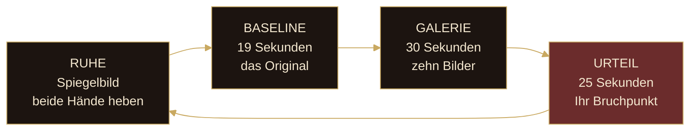

# Vallis Simulacri — wie es funktioniert

> *Ab welchem Punkt erkennt ein Mensch die eigene Spezies als falsch?*

Ein klassisches Gemälde der menschlichen Figur wird zehnmal von einer KI neu interpretiert, bis es falsch wird. Eine Kamera im Rahmen misst dabei Ihr Gesicht. Das Bild, bei dem Ihre Reaktion am stärksten ausschlägt, ist Ihr **Bruchpunkt**: Das Bild davor war für Sie noch Kunst — *ars*. Ab hier ist es keine mehr — *abeat*. Die Installation handelt nicht von KI, sondern von Ihnen.

**Die vier Phasen.** Beide Hände heben startet die Sitzung — das ist das Einverständnis. In der **Baseline** mittelt die Kamera zehnmal pro Sekunde Ihren Ausdruck vor dem Original: Ihr Nullpunkt vor echter Kunst. In der **Galerie** folgen zehn degradierte Bilder, alle drei Sekunden eines. Im **Urteil** stehen Original, das letzte noch als Kunst empfundene Bild (**ARS**, gold) und der Bruchpunkt (**ABEAT**, rot) nebeneinander.

**Wie gemessen wird.** Die Installation liest keine Gedanken, sie liest Muskeln: 468 Gesichtspunkte pro Bild, daraus 52 FACS-Blendshapes, daraus sieben Emotionskanäle. Gemessen wird nicht Ihr Ausdruck, sondern Ihre *Abweichung* von der eigenen Baseline. Die Emotionen des Unbehagens wiegen schwerer (Ekel 1,0 · Furcht 0,9 · Überraschung 0,7 · Wut 0,6 · Trauer und Freude 0,5 · Neutral 0,2) — sie sind das Signal des Uncanny Valley:

| Siegel | Bedeutung | Abweichung |
|---|---|---|
| **VALLIS** | *Das Tal* — starke Reaktion, tief gefallen | ab 0,25 |
| **LIMEN** | *Die Schwelle* — messbar, aber mild | 0,08 bis 0,25 |
| **FIRMA** | *Fester Boden* — keine Regung, *ars mansit* | unter 0,08 |

**Wie die Bilder entstehen.** Vorberechnet, nicht live. Bilder 1 bis 5 entstehen direkt aus dem Original mit steigender Freiheit — das Gemälde driftet nur. Ab Bild 6 wird die KI mit ihrer eigenen Ausgabe gefüttert: **Model Collapse**. Sie vererbt ihre eigenen Fehler und driftet auf ihren inneren Prototypen zu — Gesichter werden symmetrischer, als ein echtes je ist. Dieser Abstand zwischen menschlichem und maschinellem Verstehen ist das Uncanny Valley.

**Technik und Daten.** FastAPI + React im Browser-Kiosk, MediaPipe für die Gesichtsanalyse, Stable Diffusion v1.5 für die Bilder, Quellwerke aus dem Open Access des Metropolitan Museum of Art — alles offline auf einem Rechner im Raum. Kein Video wird aufgezeichnet: Jedes Kamerabild wird sofort zu sieben Zahlen reduziert und verworfen. Es bleibt nur die Form Ihrer Reaktion.
